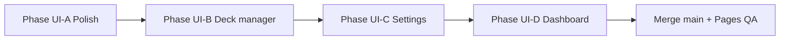

# Nexus Lingua — UI roadmap & release checklist

**Sources of truth:** `nexus_lingua_prd.md` (§7 UI/UX, §8 modules, §10 phases), `.cursorrules` (Cyber-Minimalist tokens, breakpoints, architecture), `nexus_lingua_implementation_handoff.md` (what is already built).

**Flutter root:** `nexus_lingua/`

This document is a **task-oriented UI roadmap**: what to build or polish next, in a sensible order, then how to merge, go public, and ship GitHub Pages.

---

## 1. UI baseline today (no need to redo)

| Area | Status | PRD / rules ref. |
|------|--------|------------------|
| Theme & `AppColors` | Done | PRD §7.1, `.cursorrules` §2 |
| Wide vs compact shell (`NexusResponsiveShell`, 840 lp) + Home leading/trailing rails | Done | PRD §7.5–7.6, agent plan UI-R1 |
| Breakpoint ladder (`NexusLayoutClass`, body padding helper) | Done | `nexus_breakpoints.dart` |
| Study height-aware typist gate | Done | `StudyLayout` + `studyCompactMaxHeightLp` |
| Neon glow tiers (`NexusNeon`), dashboard ΣS ring (`DashboardSigmaRing`) | Done | Agent plan UI-G (initial) |
| `FlashcardWidget`, XP bar, mastery badge | Done | PRD §7.2–7.4 |
| Study session (typist + compact FSRS row) | Done | PRD §8.3, §5 |
| Sentence decoder (MVP) | Done | PRD §8.4 |
| Home “prototype” (single profile, list, inspector read-only) | Done | Handoff §5.5 |

---

## 2. Roadmap overview

You can **parallelize** B/C/D after UI-A if multiple people work; **Deck manager** unblocks real multi-deck use; **Settings** and **Dashboard** are high PRD value but not strictly required to flip the repo public.

### 2b. Cursor UI/UX inspection plan (ordered with UI-A … UI-D)

Single backlog for agents (see also `.cursor/plans/ui_ux_inspection_and_roadmap*.plan.md` if present):

| Tag | Scope | Status (this repo) |
|-----|--------|--------------------|
| **UI-A′** | Tokens: `.cursorrules` §2 ↔ `theme_constants.dart`; glass usage doc on `nexusPanelDecoration`; prefer `ColorScheme` / `nexusExtras` in new widgets | **Done** (cyan = PRD `#00BCD4`; `nexus_surfaces` header + `NexusSectionHeader`; `NexusNeon` + glow CTAs via `NexusGlowFilledButton`) |
| **UI-R1** | `NexusResponsiveShell` **Home** `leading` + `trailing` at ≥840 lp; responsive `NexusPageScaffold` horizontal padding | **Done** |
| **UI-R2** | Optional compact `NavigationBar`; `Align` + `ConstrainedBox` max width on `large` breakpoint | **Done** (`NexusCompactNavBar` when `NexusLayoutClass.compact`; `maxContentWidthLp` in `NexusPageScaffold`) |
| **UI-G** | Tiered neon, dashboard charts | **Partial+** (above + per-profile `DashboardTierDonut` beside tier blades) |
| **UI-A11y** | Focus rings, contrast notes, reduced-motion | **Done** (theme focus `side` on filled/text/icon buttons; `NexusA11yNotes`; `NexusMotion.preferStaticMotion` on crit/beam/pulse/glow/row neon; FSRS node `focusColor`) |

---

## 3. Phase UI-A — Ship-quality polish (web-first)

**Goal:** Match PRD §7.8 and `.cursorrules` “alive but performant” before calling v1.0 web done.

- [x] **Typography:** **Inter** + **JetBrains Mono** via `google_fonts` in `AppTheme` / context extensions (`.cursorrules` §2).
- [ ] **Web verification pass:** Chrome, Edge, Safari at **320 / 390 / 768 / 1024 / 1440+** CSS logical widths — no horizontal overflow; primary taps ≥ **48 lp** (already on `FsrsRatingRow`; audit study + decoder).
- [ ] **Focus & keyboard (typist):** PRD §7.8 — `TextField` focus, Enter/submit, no input hidden behind mobile browser chrome (safe areas, scroll).
- [ ] **Empty / edge states:** Clear copy when **0 due**, **0 cards**, DB bootstrap errors (replace raw `Error: …` with actionable message + retry where possible).
- [ ] **Inspector panel (PRD §7.5):** Today = read-only JSON; either label as “debug inspector” or add **minimal** structured rows for active `LanguageProfile.features` (still no `DatabaseHelper` in widgets — use `CardRepository` / view models).
- [ ] **Motion toggles prep:** PRD §8.5 “Shader Effects” / confetti — optional `ValueNotifier` or inherited settings stub (full persistence when Settings exists).
- [ ] **`sqflite_common_ffi_web` assets:** Ensure `web/sqlite3.wasm` + `web/sqflite_sw.js` exist (`dart run sqflite_common_ffi_web:setup`) and are **committed** or generated in CI before every `flutter build web`.

### 3b. Manual browser matrix (coordination follow-up — fill each release)

Use Chrome / Edge / Safari responsive mode at **logical** widths below. Per cell: screenshot path (or link), horizontal overflow Y/N, notes.

| Width (lp) | Home | Study | Deck manager | Decoder | Dashboard | Settings |
|------------|------|-------|--------------|---------|-----------|----------|
| 320 | | | | | | |
| 390 | | | | | | |
| 768 | | | | | | |
| 1024 | | | | | | |
| 1440+ | | | | | | |

**Also verify:** compact bottom nav (width ≤ 599) does not obscure scrollable content; **Tab** focus shows **2px primary** outline on glow CTAs and app bar icons; with OS **reduced motion** / Flutter `MediaQuery.disableAnimations`, decorative orbit / green beam / mastery pulse / outer glows stay off while FSRS remains usable.

---

## 4. Phase UI-B — Deck & profile manager (PRD §8.1–8.2)

**Goal:** Replace “single seeded profile” prototype with real CRUD. All writes go through **`CardRepository`** only.

- [ ] **Language profile manager screen:** List/create/edit/delete profiles; feature checklist **F** drives which keys appear on new cards (PRD §8.1).
- [ ] **Card CRUD screen:** Dynamic form from active profile features; edit lemma, translation, metadata fields; delete card; validate before save.
- [ ] **Bulk JSON import (PRD §8.2):** File picker / paste → validate → batch insert via repository (web: use appropriate file API).
- [ ] **Home navigation:** Switch active deck / profile (rail or drawer) instead of hard-coded `firstProfile`.
- [ ] **Widget/integration tests** for critical repository-backed flows (VM; keep web-specific tests aligned with existing CI strategy).

---

## 5. Phase UI-C — Settings (PRD §8.5)

- [ ] **Mobile rating style:** Labels / symbols / color-only for `FsrsRatingRow` (persist preference — `shared_preferences` or small SQLite settings table; justify any new dependency in PRD/.cursorrules).
- [ ] **`S_max` (XP bar normalization):** Numeric field, default **365**; thread into `XpStabilityBar` (or wrapper).
- [ ] **Effect toggles:** Confetti / glow / glitch pulse on or off (PRD §8.5 + OI-03 MVP scope).
- [ ] **Backup:** Action that calls `CardRepository` / `exportToJson` and triggers browser download on web (and file save on desktop when you ship native).

---

## 6. Phase UI-D — Mastery dashboard (PRD §7.7)

- [ ] **Aggregate ΣS “total XP”** and per-profile breakdown by badge tier.
- [ ] **Streak:** Consecutive days with ≥1 review (query `review_log` / card activity).
- [ ] **Study heatmap:** GitHub-style calendar (OI-04: evaluate `calendar_view` vs custom `CustomPainter` / grid).
- [ ] **Entry point:** Rail or tab from home (wide + narrow).

---

## 7. Git: merge to `main`, then public + GitHub Pages

### 7.1 Pre-merge checklist

- [ ] `cd nexus_lingua` → `flutter analyze` clean.
- [ ] `flutter test --concurrency=1` green (or rely on **GitHub Actions** on Ubuntu for full gate).
- [ ] `flutter build web --release --base-href "/Nexus_Lingua/"` (use **your exact repo name** from the GitHub URL).
- [ ] Manual smoke: open study, complete one review, sentence decoder path, reload persistence (web SQLite).

### 7.2 Merge workflow

- [ ] Open **PR: `V0.1` → `main`**, review diff, squash or merge per your preference.
- [ ] After merge, default branch **`main`** should contain `.github/workflows/deploy_web.yml` (and `flutter_ci.yml` if present).

### 7.3 Private → public repository

- [ ] **Settings → General → Danger Zone → Change repository visibility → Public** (confirm no secrets in history).
- **GitHub Pages:** For **free personal accounts**, **public** repos are the usual way to get **free** project Pages. **Private** repo Pages is available on **paid** GitHub plans (Pro/Team/Enterprise) — if you stay private, check [GitHub Pages docs](https://docs.github.com/en/pages/getting-started-with-github-pages/github-pages-limits) for your account type.

### 7.4 GitHub Pages

- [ ] **Settings → Pages → Build and deployment → Source: GitHub Actions**.
- [ ] Push to `main` (or run **Deploy Web** workflow manually). First successful deploy shows the site URL (typically `https://<user>.github.io/Nexus_Lingua/`).
- [ ] Confirm **`--base-href`** matches path after `github.io` (workflow uses `/${{ github.event.repository.name }}/`).

---

## 8. Suggested execution order (minimal path to public Pages)

1. Complete **UI-A** (especially wasm setup + multi-browser pass).  
2. Merge **`V0.1` → `main`**, enable Actions Pages, verify deploy.  
3. Make repo **public** (if required for your billing tier).  
4. Continue **UI-B → C → D** on `main` or feature branches without blocking the site going live.

---

*Last aligned with PRD v1.0 sections §7–§8, §10 and `.cursorrules` §2–§3.*
